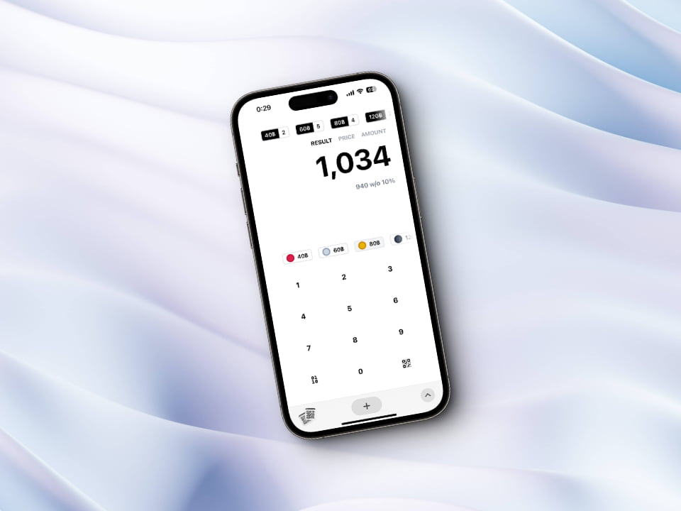

# Sushiro calculator



An easy-to-use calculator for counting Sushiro plates, and generating a QR code for Promptpay payment.

## Usage

Go to [sushiro.rayriffy.com][https://sushiro.rayriffy.com], and add this web page to your home screen. This will make it easier to access, and transform this web into a full application.

## Development

This project is built with [Svelte](https://svelte.dev), and [Vite](https://vitejs.dev). To start developing, you need to have Node.js installed on your machine, and running following command.

```bash
git clone git@github.com:rayriffy/sushiro.git
cd sushiro
pnpm i
pnpm dev
```

Development server will be running on [localhost:5173](http://localhost:5173).
